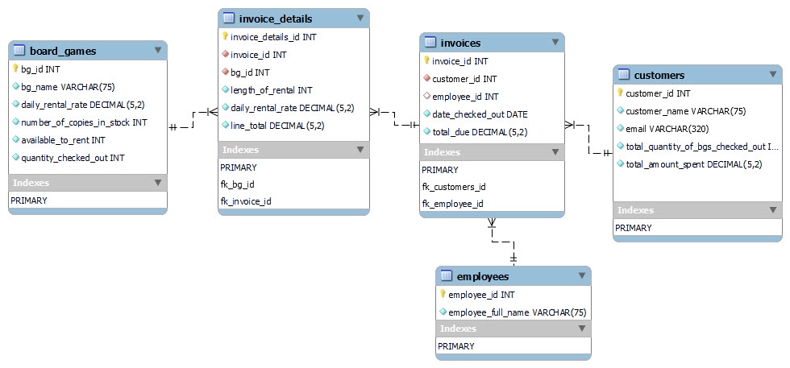

# Board Game Rentals 🎲

## Our Vision for Fun and Functionality

Welcome to "Board Game Rentals," where the love for board games meets the finesse of technology! This document isn't just a manual; it's a glimpse into our passion for creating a space where board game cafes and their patrons can connect effortlessly.

#### Crafted by Enthusiasts:

- [Luis Sosa](https://github.com/luisJsosa/) - Focused on the web interface design, frontend development, and testing, ensuring an engaging and user-friendly experience. Conducted UX research and gathered feedback, which was crucial for refining the user interface. Implemented Bootstrap for responsive design, and handled dynamic webpage behavior using JavaScript. Additionally, coordinated project deployment to the server, gathered requirements, and created the project documentation.

- [Paola Cernada](https://github.com/paolacernada/) - Responsible for the MySQL database design, including creating and testing the database to ensure robustness and reliability. Contributed significantly to the implementation of the Flask backend, establishing a stable and efficient server-side framework. Additionally, worked on project deployment to the server alongside Luis.

### Contributions:

**Luis Sosa Lora**:
- **Web Interface and Frontend Design**: Crafted the visual elements and layout of the web interface, focusing on aesthetics and user interaction.
- **UX Research and Feedback Integration**: Conducted user experience research, gathering valuable insights to enhance the usability of the web interface.
- **Implementing Bootstrap**: Utilized Bootstrap to ensure a responsive and visually appealing design across various devices.
- **JavaScript for Dynamic Webpage Behavior**: Implemented JavaScript to add interactivity and dynamic elements to the web interface, enhancing user engagement.
- **Dynamic HTML Content through Jinja Templating Engine**: Utilized a Jinga templating engine to generate dynamic HTML content, making the website more interactive and user-friendly.
  
**Paola Cernada**:
- **MySQL Database Design**: Developed a comprehensive and efficient database structure, laying the foundation for robust data management.
- **Sample Data Creation**: Curated a variety of sample data, essential for demonstrating the database's functionality and for testing purposes.
- **Database Testing**: Rigorously tested the database to ensure data integrity and reliability, a critical aspect of backend development.
- **Flask Backend Implementation**: Integrated Flask to manage server-side operations, providing a stable and efficient backend framework.
- **Dynamic HTML Content through Jinja Templating Engine**: Utilized a Jinga templating engine to generate dynamic HTML content, making the website more interactive and user-friendly.

**Joint Contributions**:
- **Project Deployment to Server**: Collaborated in deploying the project to a server, ensuring the application is accessible and runs smoothly.

## Goals: The Heart of Our Game

Our mission? To build a web interface that's not just functional but also a joy to use. Think of it as the perfect blend of tech and fun, offering Create-Read-Update-Delete (CRUD) capabilities with a twist of user-friendly design.

## Building Blocks: Our Game Plan

Here's what makes our project tick:

1. **Data Playground**: Our database is a treasure trove, pre-loaded with games to showcase every feature in full color.
2. **Relational Dynamics**: We've crafted a web of entities and relationships, including a many-to-many relationship that's as intriguing as a game strategy.
3. **Admin's Arena**: Designed for those behind the scenes (the café wizards), our interface focuses on managing the magic, not the mundane.
4. **One Page, One Story**: Each database entity gets its own spotlight in our UI, making navigation a part of the adventure.
5. **Optional Home Base**: A welcoming home page to kick things off? Your call!

## Executive Summary: Leveling Up

### Refining the Game Board

- Ditched the redundant table to streamline our data flow.
- Upgraded key tables for better performance and clarity.

### Master Moves Implemented

- Added nuances with nullable relationships.
- Integrated cascade delete for a flawless game experience.
- Leveraged join queries for smarter, faster data retrieval.

### Evolution Through Feedback

We shifted gears from Node.js to Flask, a move inspired by hands-on experience and valuable feedback. The result? A smoother, more efficient pathway to delivering an exceptional board game rental experience.

## Database Design and Sample Data Screenshots

### Database Design:
This section includes a comprehensive screenshot of the database schema, illustrating the structure of the entire database and how the tables are interconnected.

- **Complete Database Schema**: Showcases the structure of all tables including `board_games`, `customers`, `invoices`, `invoice_details`, and `employees`.
  

### Sample Data:
Screenshots of sample data in each table, demonstrating how the data is organized and stored.

- **Board Games Table Sample Data**: Illustrates sample records in the `board_games` table.
   <!-- Replace with your screenshot link -->

- **Customers Table Sample Data**: Displays sample customer records.
   <!-- Replace with your screenshot link -->

- **Invoices Table Sample Data**: Shows sample invoice records.
   <!-- Replace with your screenshot link -->

- **Invoice Details Table Sample Data**: Presents sample records in the `invoice_details` table.
   <!-- Replace with your screenshot link -->

- **Employees Table Sample Data**: Displays sample employee records.
   <!-- Replace with your screenshot link -->

## UI Screenshots

### Home Page:
- **Home Page Screenshot**: Shows the initial landing page of the website.
   <!-- Replace with your screenshot link -->

### Board Games Management:
- **Board Games Display – Read Step**: Illustrates how the board games are displayed on the website.
   <!-- Replace with your screenshot link -->

- **Board Games Add – Create Step**: A view of the interface for adding new board games.
   <!-- Replace with your screenshot link -->

- **Board Games Update – Update Step**: Demonstrates the update functionality for board games.
   <!-- Replace with your screenshot link -->

- **Board Games Delete – Delete Step**: Showcases the delete functionality for board games.
   <!-- Replace with your screenshot link -->

### Customers Management:
- **Customers Display – Read Step**: Displays how customer information is presented.
   <!-- Replace with your screenshot link -->

- **Customers Add – Create Step**: Interface for adding new customers.
   <!-- Replace with your screenshot link -->

- **Customers Update – Update Step**: Shows the customer update process.
   <!-- Replace with your screenshot link -->

- **Customers Delete – Delete Step**: Demonstrates the process of deleting a customer record.
   <!-- Replace with your screenshot link -->

### Invoices Management:
- **Invoices Display – Read Step**: Illustrates how invoices are displayed.
   <!-- Replace with your screenshot link -->

- **Invoices Add – Create Step**: Shows the interface for creating new invoices.
   <!-- Replace with your screenshot link -->

- **Invoices Update – Update Step**: Displays the invoice update functionality.
   <!-- Replace with your screenshot link -->

- **Invoices Delete – Delete Step**: Shows how invoices are deleted.
   <!-- Replace with your screenshot link -->

### Invoice Details Management:
- **Invoice Details Display – Read Step**: Displays the interface for viewing invoice details.
   <!-- Replace with your screenshot link -->

- **Invoice Details Add – Create Step**: Interface for adding new invoice details.
   <!-- Replace with your screenshot link -->

- **Invoice Details Update – Update Step**: Demonstrates the update functionality for invoice details.
   <!-- Replace with your screenshot link -->

## The Challenge and Our Solution

**The Quest**: In a world where board games became the heroes of home entertainment, board game cafes sprouted up needing a digital ally.

**Our Magic Potion**: A web-based beacon that guides café owners through the maze of game rentals and inventory management.

## Toolkit of Choice

- **Flask**: Our wizard's wand for web development.
- **MySQL**: The backbone of our data kingdom.
- **phpMyAdmin & SQL Workbench**: Our crystal balls for database interactions.
- **Jinja2 & Bootstrap**: The artists painting our UI with strokes of functionality and style.

## Deployment and Testing on Local Server

To deploy and test the project on a local server, follow these steps:

1. Install Python: Ensure that Python is installed on your system. You can download and install the latest version of Python from the official Python website [python.org](https://www.python.org)..

2. Set Up a Virtual Environment: Create a virtual environment for your project to isolate its dependencies. Open your command-line interface, navigate to the project directory, and run the following command:
   ```
   python -m venv venv
   ```
   
3. Activate the Virtual Environment: Activate the virtual environment by running the appropriate command for your operating system:
   - Windows:
     ```
     venv\Scripts\activate
     ```
   - macOS/Linux:
     ```
     source venv/bin/activate
     ```

4. Install Dependencies: Install the required Python packages by executing the following command:
   ```
   pip install -r requirements.txt
   ```

5. Set Up the Database: Set up a MySQL database using phpMyAdmin or any other MySQL administration tool. Create a new database for the project and import the provided SQL file to initialize the tables and sample data.

6. Configure the Database Connection: In the project's configuration file (`config.py` or similar), modify the database connection settings to match your local MySQL configuration. Update the database host, username, password, and database name accordingly.

7. Run the Application: Start the Flask development server by running the following command in the project directory:
   ```
   flask run
   ```

8. Access the Application: Open a web browser and navigate to `http://localhost:5000` (or the URL provided by the Flask server). The application should now be running locally.

9. Test the Application: Use the web interface to interact with the database and test the CRUD functionalities. Create, read, update, and delete records to ensure that the application behaves as expected. Verify that the data is correctly stored and retrieved from the database.

By following these steps, you should be able to successfully deploy and test the project on your local server.
